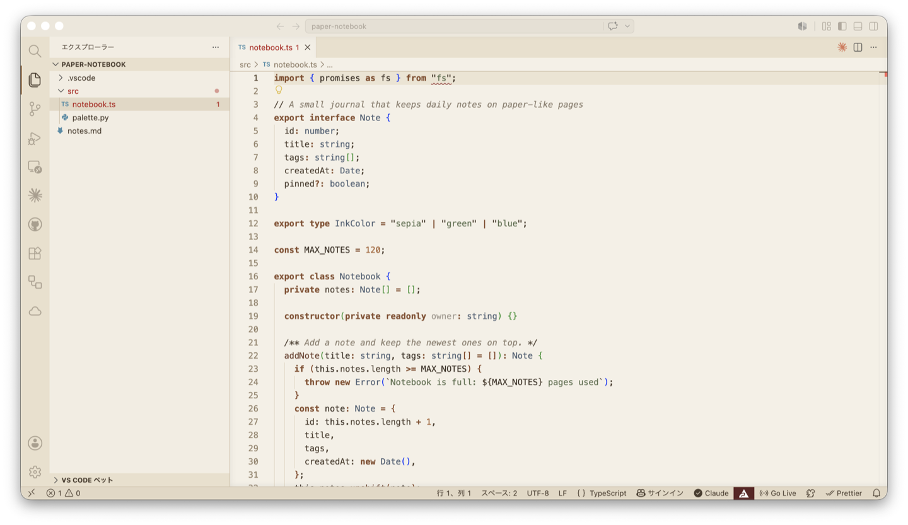
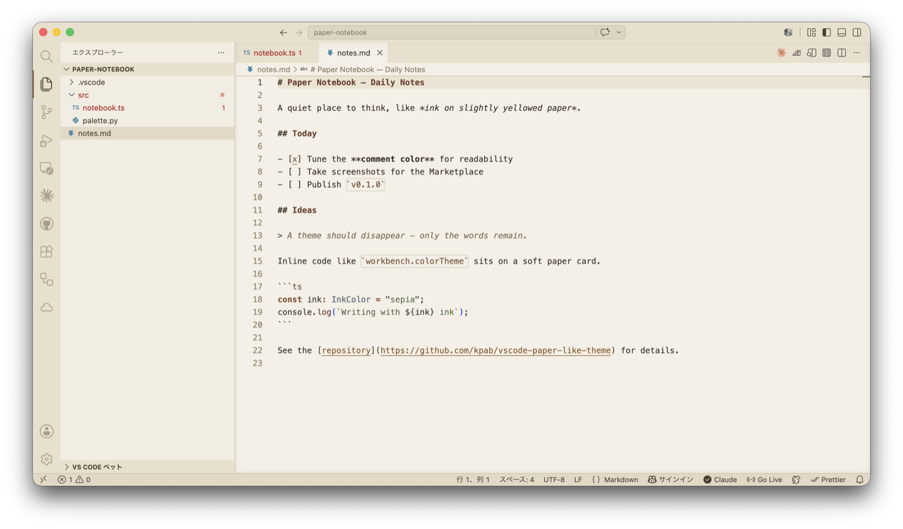

# Paper Notebook Light

紙っぽいノート風のVS Codeライトテーマ

[English](README.md) | 日本語

## コンセプト

白いディスプレイ感ではなく、**少し黄味がかった紙の上にインクで書いているような質感**のテーマです。

- 目にやさしいオフホワイト背景（真っ白を使わない）
- インク風のシンタックスカラー：キーワードは茶インク、文字列は深緑、型は褪せた青インクの差し色
- コメントや行番号は可読性を保った柔らかい鉛筆トーン
- ターミナル・サイドバー・ウィジェット・メニューまで、ワークベンチ全体が紙トーンで統一

## スクリーンショット

<!-- TODO: 公開前にスクリーンショットを追加。推奨ショット:
  images/overview.png   — サイドバー+ターミナルを開いたエディタ全景
  images/typescript.png — TypeScriptのコード例
  images/markdown.png   — Markdown編集画面




-->

*スクリーンショットは準備中です。*

## 使い方

[Marketplace](https://marketplace.visualstudio.com/items?itemName=kpab.paper-notebook-light) からインストール（またはクイックオープン `Ctrl+P` / `Cmd+P` で `ext install kpab.paper-notebook-light` を実行）した後：

1. `Ctrl+K Ctrl+T`（macOS: `Cmd+K Cmd+T`）を押す
2. **Paper Notebook Light** を選択

## 推奨フォント設定

テーマと合わせて、以下のフォント設定を `settings.json` に追加すると、より紙ノート風の雰囲気になります。

```json
{
  "editor.fontFamily": "'Iosevka', 'JetBrains Mono', 'Cascadia Code', Menlo, Monaco, 'Courier New', monospace",
  "editor.fontSize": 14,
  "editor.lineHeight": 22,
  "editor.letterSpacing": 0.2,
  "editor.renderLineHighlight": "line",
  "editor.cursorBlinking": "smooth"
}
```

### 推奨フォント例

- **Iosevka** - 整った手書き風・可読性高い
- **JetBrains Mono** - モダンで読みやすい
- **Cascadia Code** - Microsoftの美しいコーディングフォント

> 注：フォントは事前にシステムにインストールしておく必要があります。

## カラーパレット

| 要素 | 色 | 説明 |
| --- | --- | --- |
| 背景色 | `#F5F0E6` | 温かみのある紙色 |
| 前景色 | `#3A2E23` | インク風のダークブラウン |
| キーワード | `#854D2C` | 濃いブラウン（太字） |
| 文字列 | `#5C6E4E` | くすんだ深緑インク |
| 型 | `#4E5F73` | 褪せた青インク |
| 関数 | `#6C3F2C` | 焦げ茶 |
| 数値 | `#A86434` | オレンジブラウン |
| コメント | `#8A7D6D` | 柔らかい鉛筆グレー（イタリック） |

## 開発

ローカルで変更を試したい・自分でビルドしたい場合:

1. このリポジトリをクローン
   ```bash
   git clone https://github.com/kpab/vscode-paper-like-theme.git
   cd vscode-paper-like-theme
   ```

2. 拡張機能開発ホストで試す：VS Code でフォルダを開いて `F5` を押し、`Ctrl+K Ctrl+T` / `Cmd+K Cmd+T` でテーマを選択

3. または VSIX をパッケージしてインストール:
   ```bash
   npm run package
   npm run install-extension
   ```

## ライセンス

MIT
